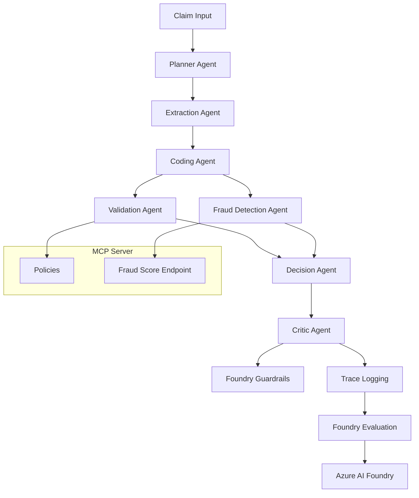

# AgenticClaimsProcessing

## Overview

AgenticClaimsProcessing is a production-style healthcare claims processing and fraud detection system built on Azure AI Foundry. It demonstrates a complete multi-agent orchestration design using Foundry-native LLM deployment, centralized policy rules, fraud RAG, and enterprise-grade observability.

The system is intended for engineering and instructional use, with a clean folder structure, clear separation of concerns, and a deployable pipeline for claims ingestion, coding, validation, fraud detection, decisioning, and evaluation.

## What this project does

- Ingests healthcare claims as JSON or document-based submissions.
- Extracts structured claim data via document intelligence.
- Maps services to ICD/CPT codes using Foundry-hosted GPT-4o reasoning.
- Validates claims against MCP-served policy rules and constraints.
- Detects fraud with a hybrid approach using Search-based retrieval and an external fraud scoring API.
- Makes a final decision: Approve, Reject, or Flag for Review.
- Reviews quality and safety through Foundry Guardrails.
- Logs traces and stores evaluation metrics in Azure AI Foundry.

## Architecture



## Core Components

### Agents

- `Planner Agent` — builds the orchestration path.
- `Extraction Agent` — normalizes raw claim data.
- `Coding Agent` — maps service descriptions to ICD/CPT.
- `Validation Agent` — applies MCP policies.
- `Fraud Detection Agent` — hybrid fraud risk analysis using Azure Search and fraud scoring.
- `Decision Agent` — selects final outcome.
- `Critic Agent` — applies guardrail and quality review.

### Tooling

- `app/tools/foundry_sdk.py` — logs traces and evaluations to Foundry.
- `app/tools/foundry_guardrails.py` — executes Foundry guardrail evaluations.
- `app/tools/openai_client.py` — invokes the Foundry-hosted LLM deployment.
- `app/tools/document_intelligence.py` — uses Azure Document Intelligence for extraction.
- `app/tools/ai_search.py` — queries Azure AI Search for fraud patterns.
- `app/tools/rules_engine.py` — fetches MCP policy and validates claims.
- `app/tools/external_fraud_api.py` — sends claim data to the fraud scoring endpoint.

### MCP Server

- `app/mcp/server.py` — serves policy rules and a local fraud score endpoint.
- `app/mcp/policies.py` — defines policy bundles and rules.
- `app/mcp/schemas.py` — Pydantic models for policies and fraud scoring.

### Evaluation

- `app/evaluations/evaluator.py` — computes groundedness, relevance, safety, and fraud confidence metrics.

## Repository Structure

- `app/` — main application package.
- `app/agents/` — agent definitions and workflow orchestration.
- `app/tools/` — service connectors and Azure integration clients.
- `app/mcp/` — policy and MCP server logic.
- `app/evaluations/` — evaluation pipeline.
- `app/data/sample/` — sample claim data.
- `scripts/` — starter scripts for local execution and setup.
- `.env.example` — configuration template.
- `requirements.txt` — Python dependencies.

## Required Azure Resources

- Azure AI Foundry project
- Azure AI Foundry-hosted LLM model deployment (e.g. `gpt-4o`)
- Azure Document Intelligence / Form Recognizer resource
- Azure Cognitive Search service
- Azure AI Search index for fraud/suspicion patterns
- Optional: Azure AI Foundry Guardrails configured in the Foundry project

## Environment Configuration

Create `.env` from `.env.example` and populate:

```text
AZURE_OPENAI_DEPLOYMENT=gpt-4o
AZURE_FOUNDRY_ENDPOINT=https://<your-foundry-endpoint>
AZURE_FOUNDRY_PROJECT_ID=<your-foundry-project-id>
AZURE_FOUNDRY_API_KEY=<your-foundry-api-key>
AZURE_FORM_RECOGNIZER_ENDPOINT=https://<your-formrecognizer-endpoint>.cognitiveservices.azure.com/
AZURE_FORM_RECOGNIZER_KEY=<your-formrecognizer-key>
AZURE_SEARCH_ENDPOINT=https://<your-search-service>.search.windows.net
AZURE_SEARCH_KEY=<your-search-key>
AZURE_SEARCH_INDEX=healthcare-fraud-index
FRAUD_API_URL=http://127.0.0.1:8000/fraud-score
FRAUD_API_KEY=YOUR_FRAUD_API_KEY
MCP_HOST=127.0.0.1
MCP_PORT=8000
LOG_LEVEL=INFO
ENVIRONMENT=development
```

## Execution Checklist

1. Install dependencies.
2. Configure `.env`.
3. Start the MCP server.
4. Register agents in Foundry (optional but recommended).
5. Execute a claim through the orchestrator.
6. Run the evaluation pipeline.

## Step-by-Step Run Instructions

### 1. Install dependencies

```bash
python -m pip install -r requirements.txt
```

### 2. Configure `.env`

Copy `.env.example` to `.env` and update values for your environment.

### 3. Start the local MCP server

```bash
python scripts/run_mcp.py
```

This server exposes:
- `GET /policies`
- `GET /constraints`
- `GET /allowed-procedures`
- `POST /fraud-score`
- `GET /health`

### 4. Register agents in Foundry

```bash
python scripts/deploy_foundry_agents.py
```

If your Foundry project already has agents registered, this step verifies and registers the same named agent definitions.

### 5. Run claim processing locally

```bash
python scripts/run_local.py
```

This executes the full end-to-end workflow using `app/data/sample/claim_sample.json`.

### 6. Run evaluation

```bash
python scripts/eval_run.py
```

This computes the evaluation metrics and stores them in Foundry.

## Execution Notes

- The LLM client is Foundry-only and invokes the deployed model via `app/tools/openai_client.py`.
- The system logs processing traces and evaluation data back into the Foundry project via `app/tools/foundry_sdk.py`.
- The MCP server is the single source of truth for policy rules and local mock fraud scoring.
- Sample claim data is available at `app/data/sample/claim_sample.json`.

## Student Guidance

This repository is designed to teach enterprise-grade GenAI architecture:
- multi-agent decomposition
- external policy service integration
- RAG-based fraud retrieval
- Foundry-native LLM invocation
- Responsible AI guardrails and audit logging
- evaluation metrics stored in Foundry

Students should explore:
- `app/agents/orchestrator.py`
- `app/mcp/server.py`
- `app/tools/openai_client.py`
- `app/tools/foundry_guardrails.py`
- `app/evaluations/evaluator.py`

## Additional References

- `requirements.txt` for dependency installation
- `scripts/run_mcp.py` to start policy service
- `scripts/deploy_foundry_agents.py` to register agents
- `scripts/run_local.py` for end-to-end processing
- `scripts/eval_run.py` for evaluation review

## Final Validation

The codebase has been validated via Python compilation after cleanup.

## One-Page Handout

### Essential Architecture

- `Planner Agent` → selects workflow steps
- `Extraction Agent` → claim ingestion and normalization
- `Coding Agent` → ICD/CPT mapping via Foundry LLM
- `Validation Agent` → MCP policy rules enforcement
- `Fraud Detection Agent` → Azure Search + fraud score
- `Decision Agent` → approve/reject/flag decision
- `Critic Agent` → Foundry guardrail safety review
- `Trace & Evaluation` → logged to Azure AI Foundry

### Required Azure Resources

- Azure AI Foundry project
- Foundry-hosted LLM deployment (`gpt-4o`)
- Azure Document Intelligence resource
- Azure Cognitive Search service + index
- Azure AI Foundry Guardrails enabled

### Quick Start Commands

```bash
python -m pip install -r requirements.txt
cp .env.example .env
# update .env with Foundry and Azure values
python scripts/run_mcp.py
python scripts/deploy_foundry_agents.py
python scripts/run_local.py
python scripts/eval_run.py
```

### Key Files

- `app/agents/orchestrator.py`
- `app/tools/openai_client.py`
- `app/tools/foundry_guardrails.py`
- `app/mcp/server.py`
- `scripts/run_local.py`
- `scripts/run_mcp.py`
- `scripts/eval_run.py`

### Student Checklist

- [ ] Configure `.env` correctly
- [ ] Start MCP server
- [ ] Register agents in Foundry
- [ ] Execute claim orchestration
- [ ] Review Foundry trace and evaluation output
